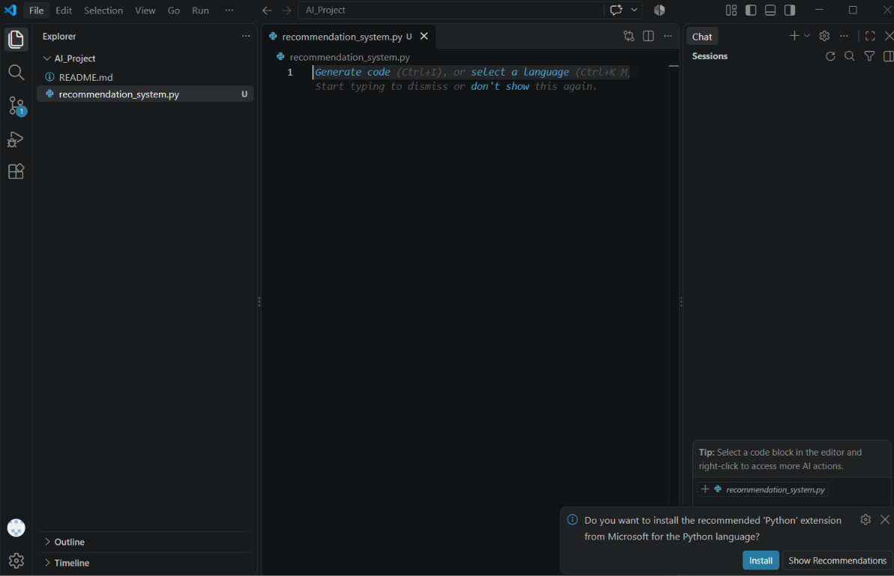
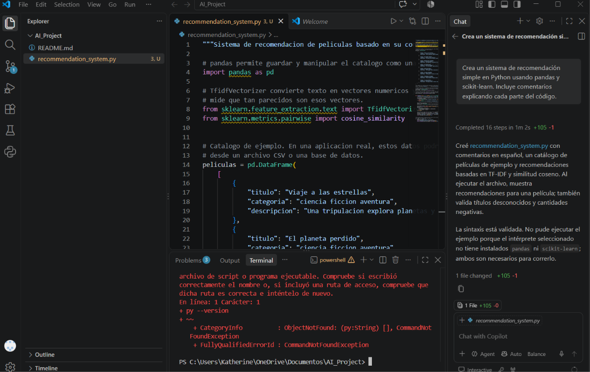
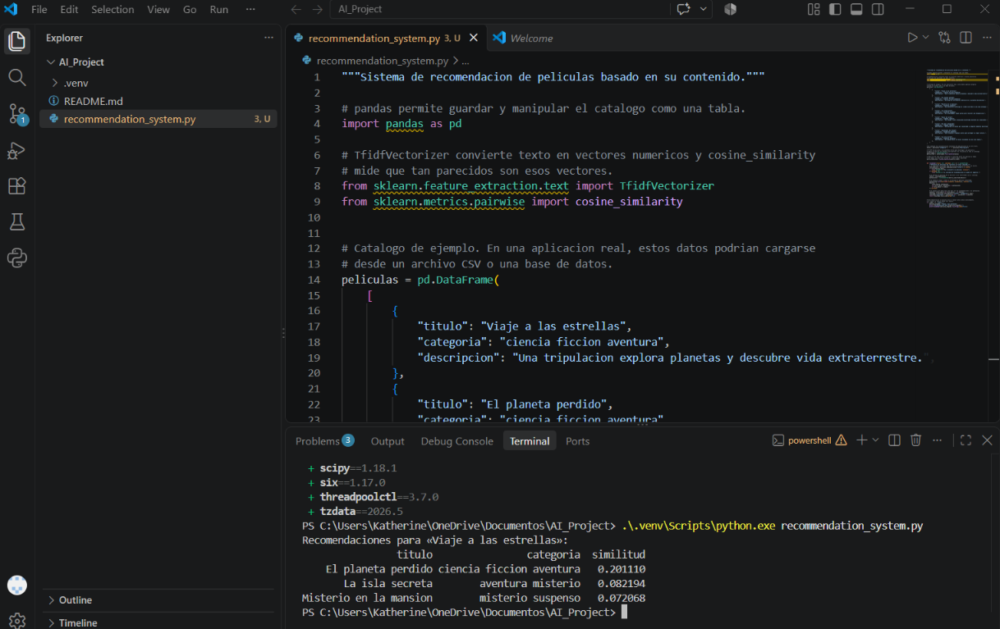
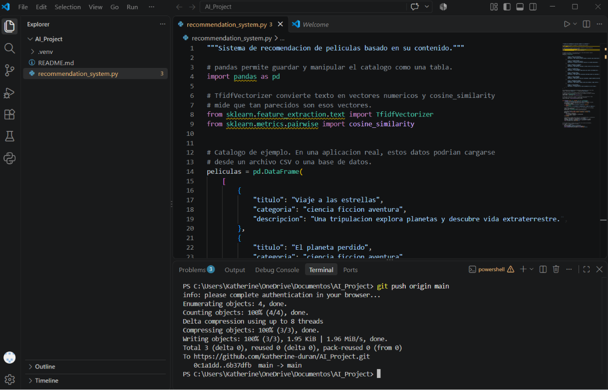

# AI_Project

## Sistema de recomendación utilizando GitHub Copilot

Este proyecto fue desarrollado como parte de una actividad práctica de Inteligencia Artificial. El objetivo fue utilizar GitHub Copilot como herramienta de apoyo para generar código y desarrollar un sistema de recomendación simple utilizando Python.

## 1. Creación del proyecto

Se creó un repositorio llamado `AI_Project` y posteriormente se abrió el proyecto en Visual Studio Code.

Dentro del proyecto se creó el archivo:

`recommendation_system.py`

Este archivo contiene el código principal del sistema de recomendación.

## 2. Uso de GitHub Copilot

Se utilizó GitHub Copilot desde Visual Studio Code para generar un sistema de recomendación simple en Python.

Se solicitó a Copilot crear el programa utilizando las bibliotecas `pandas` y `scikit-learn`, incluyendo comentarios que explicaran las distintas partes del código.

## 3. Funcionamiento del sistema

El programa contiene un pequeño catálogo de películas con información como:

- Título
- Categoría
- Descripción

Para generar las recomendaciones se utiliza `TfidfVectorizer`, que transforma el texto de las películas en representaciones numéricas.

Posteriormente se utiliza `cosine_similarity` para calcular qué tan similares son las películas entre sí.

De esta manera, al seleccionar una película, el programa puede mostrar otras películas con contenido similar.

## 4. Configuración de Python

Para ejecutar el proyecto se instaló Python y se creó un entorno virtual llamado `.venv`.

También se instalaron las bibliotecas necesarias para el funcionamiento del programa:

- pandas
- scikit-learn

## 5. Ejecución del programa

El programa fue ejecutado desde la terminal de Visual Studio Code.

Como prueba se utilizó la película **"Viaje a las estrellas"** y el sistema generó recomendaciones de películas según su similitud.

La ejecución permitió comprobar que el sistema de recomendación funciona correctamente.

## 6. Control de versiones con Git y GitHub

Se utilizó Git para realizar el control de versiones del proyecto.

Los archivos fueron agregados al repositorio, se realizó un commit y posteriormente se utilizó `git push` para subir los cambios al repositorio remoto de GitHub.

## 7. Evidencias del desarrollo

A continuación se incorporan capturas de pantalla que muestran las principales etapas del desarrollo del proyecto.

### Evidencia 1: Creación del archivo Python!

Captura de la creación del archivo `recommendation_system.py` en Visual Studio Code.

### Evidencia 2: Generación del código con GitHub Copilot

Captura del código generado con apoyo de GitHub Copilot.

### Evidencia 3: Ejecución del sistema de recomendación!

Captura de la terminal mostrando las recomendaciones generadas por el programa.

### Evidencia 4: Repositorio en GitHub!

Captura que demuestra que el proyecto fue subido correctamente al repositorio remoto.

## Conclusión

Esta actividad permitió utilizar GitHub Copilot como herramienta de apoyo para el desarrollo de un programa en Python. Se implementó un sistema de recomendación basado en contenido utilizando TF-IDF y similitud coseno. Además, se practicó el uso de Visual Studio Code, entornos virtuales, Git y GitHub para desarrollar y almacenar el proyecto.